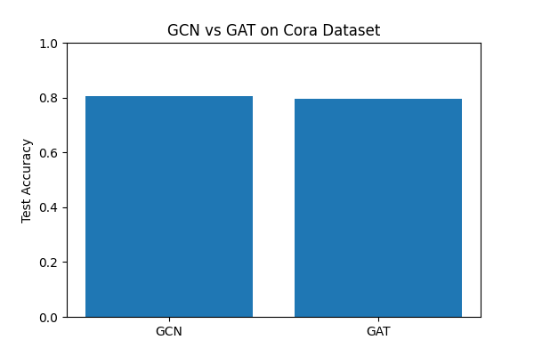

# Performance Comparison of GCN and GAT for Node Classification

## Graph Representation Learning Project

This project compares the performance of two popular Graph Neural Network (GNN) architectures:

- Graph Convolutional Network (GCN)
- Graph Attention Network (GAT)

The models are evaluated on the Cora citation dataset for the task of node classification using PyTorch Geometric.

---

# Research Question

How does the performance of Graph Convolutional Networks (GCN) compare to Graph Attention Networks (GAT) for node classification on citation network datasets?

---

# Dataset

The experiments use the Cora citation network dataset.

Dataset statistics:

- Nodes: 2708
- Edges: 10556
- Node Features: 1433
- Classes: 7

In the dataset:
- nodes represent research papers
- edges represent citation links
- labels represent paper categories

---

# Models

## Graph Convolutional Network (GCN)

The GCN model uses graph convolution layers to aggregate neighborhood information efficiently.

Architecture:
- 2 GCN layers
- ReLU activation
- LogSoftmax output

---

## Graph Attention Network (GAT)

The GAT model introduces attention mechanisms to learn the importance of neighboring nodes.

Architecture:
- 2 GAT layers
- Multi-head attention
- ELU activation
- Dropout regularization

---

# Experimental Setup

Frameworks used:
- PyTorch
- PyTorch Geometric

Training setup:
- Optimizer: Adam
- Epochs: 200
- GCN Learning Rate: 0.01
- GAT Learning Rate: 0.005

---

# Results

| Model | Test Accuracy | Training Time |
|------|------|------|
| GCN | 80.6% | 4.85 seconds |
| GAT | 79.9% | 32.83 seconds |

The experiments show that GCN achieved slightly higher classification accuracy while training significantly faster than GAT on the Cora dataset.

---

# Visualizations

## Accuracy Comparison



---

# Conclusion

This project demonstrates that more complex attention-based architectures do not always guarantee improved performance.

Although GAT introduces adaptive neighborhood attention, the simpler GCN architecture achieved better overall performance in this experimental setting.

---

# Repository Structure

```text
project_gcn_gat.ipynb
comparison_plot.png
gcn_loss_curve.png
README.md
```

---

# References

- Kipf, T. N., & Welling, M. (2017). Semi-Supervised Classification with Graph Convolutional Networks.
- Veličković, P., et al. (2018). Graph Attention Networks.
- PyTorch Geometric Documentation.
